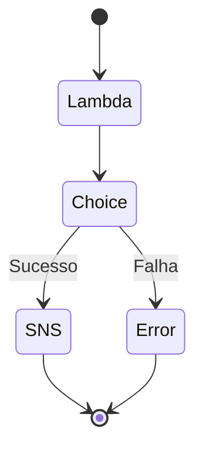

# 🚀 Desafio – AWS Step Functions

Este desafio faz parte do módulo **"Serviços Intermediários e Avançados: Explorando Workflows Automatizados com AWS Step Functions"** do Bootcamp **Code Girls 2025 (Santander/DIO)**.  
O objetivo foi colocar em prática os conceitos de **orquestração de serviços AWS** e **automação de workflows serverless**.

---

## 🎯 Objetivos de Aprendizagem

- Aplicar os conceitos aprendidos sobre **Step Functions** em um ambiente prático;  
- Documentar o processo técnico de forma clara e organizada;  
- Utilizar o **GitHub** como ferramenta de registro e portfólio técnico.

---

## 🧩 O que são AWS Step Functions

AWS Step Functions é um serviço da AWS que **orquestra fluxos de trabalho** entre diferentes serviços.  
Com ele, é possível criar **máquinas de estado (State Machines)** que definem a sequência de execução das tarefas — como funções Lambda, envio de mensagens SNS/SQS, gravação no DynamoDB, entre outros.

Cada **estado** representa uma etapa do processo, e pode ser configurado como:
- **Task:** executa uma função ou serviço;
- **Choice:** define caminhos condicionais;
- **Wait:** adiciona uma pausa no fluxo;
- **Parallel:** executa tarefas simultâneas;
- **Fail / Succeed:** definem encerramento com erro ou sucesso.

---

## ⚙️ Exemplo Prático

Fluxo de exemplo implementado no laboratório:

1. **Início:** evento inicia o Step Function.  
2. **Execução Lambda:** função processa os dados.  
3. **Validação (Choice):** verifica se houve erro ou sucesso.  
4. **Envio de Notificação (SNS):** em caso de sucesso, envia mensagem de conclusão.  
5. **Finalização:** encerra o fluxo com sucesso ou erro.

🖼️ **Representação visual (Mermaid):**

## ✨ Conclusão

O desafio proporcionou uma visão prática de como construir workflows escaláveis, organizados e fáceis de manter, aproveitando todo o ecossistema AWS.
Foi uma ótima oportunidade para consolidar o uso de Step Functions como ferramenta de integração e automação dentro de arquiteturas serverless.