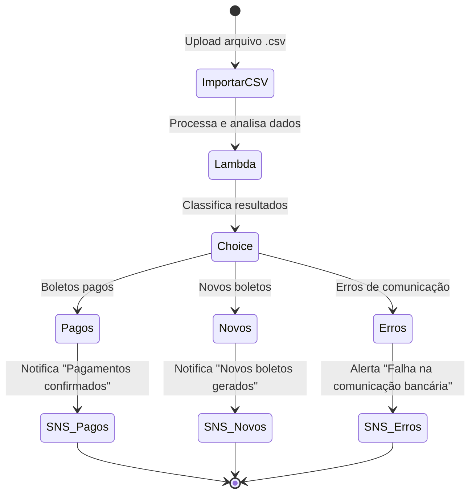

# 💡 Desafio: AWS Step Functions — Automação Financeira com Boletos 

Neste projeto, foi desenvolvida uma simulação prática de um **processo financeiro automatizado**, que integra **AWS Lambda, SNS e Step Functions** para processar arquivos de retorno bancário contendo informações sobre **boletos pagos, novos e com erro de comunicação**.

---

## 🧠 Objetivo
Demonstrar como os conceitos de **serverless** e **orquestração de fluxos** podem ser aplicados a um cenário real de automação financeira, reduzindo tarefas manuais e aumentando a eficiência operacional.

---

## ⚙️ Arquitetura e Fluxo do Processo

### 🧾 Cenário:
Todos os dias, o time financeiro importa do banco um arquivo `.csv` com o **retorno dos boletos** do dia anterior.  
Esse arquivo contém as seguintes informações:
- Boletos **pagos**
- Boletos **novos (emitidos no dia anterior)**
- Boletos com **erro de comunicação bancária**

O **AWS Lambda** é acionado automaticamente ao receber o arquivo, processa e classifica os registros.  
Em seguida, o **AWS Step Functions** coordena o fluxo das ações, decidindo os próximos passos conforme o tipo de retorno encontrado.  
Por fim, o **Amazon SNS** envia notificações personalizadas para cada situação.

---

## 🔄 Fluxo Detalhado

1. **Upload do CSV**  
   O arquivo de retorno do banco é enviado para um bucket S3.  
   Esse evento aciona automaticamente a execução de uma função **AWS Lambda**.

2. **Processamento pelo Lambda**  
   O Lambda lê e interpreta o CSV, classificando as linhas em três grupos:
   - Boletos **Pagos**
   - Boletos **Novos**
   - Boletos com **Erros de Comunicação**

3. **Decisão (Choice State)**  
   O **Step Functions** recebe os resultados e decide qual caminho seguir:
   - Caso “Pago” → Atualiza o sistema interno e envia notificação de confirmação via SNS.  
   - Caso “Novo” → Registra novos boletos gerados e envia alerta de acompanhamento.  
   - Caso “Erro” → Envia um relatório de falhas detalhando o motivo de cada erro para o time financeiro.

4. **Notificação (SNS)**  
   O **Amazon SNS** envia mensagens automáticas aos responsáveis:
   - 📩 **Pagos:** confirmação de recebimento  
   - 🧾 **Novos:** registro de novos boletos  
   - ⚠️ **Erros:** relatório com motivos de falha  

5. **(Opcional)** O sistema interno da empresa pode consumir essas mensagens e:
   - Dar **baixa automática** nos boletos pagos  
   - Registrar **novos boletos emitidos**  
   - Exibir **motivos de falha** para correção manual pelo time financeiro

---

## 🗺️ Diagrama do Fluxo (Mermaid)

## ✨ Conclusão

O desafio proporcionou uma visão prática de como construir workflows escaláveis, organizados e fáceis de manter, aproveitando todo o ecossistema AWS.
Foi uma ótima oportunidade para consolidar o uso de Step Functions como ferramenta de integração e automação dentro de arquiteturas serverless.
Esse projeto demonstra como a automação inteligente via Step Functions pode ser aplicada a cenários financeiros do dia a dia, reduzindo a carga manual da equipe e garantindo integridade nas operações.
Além de servir como um exercício técnico, o fluxo criado aqui representa uma solução escalável e segura para empresas que lidam com grandes volumes de transações bancárias.