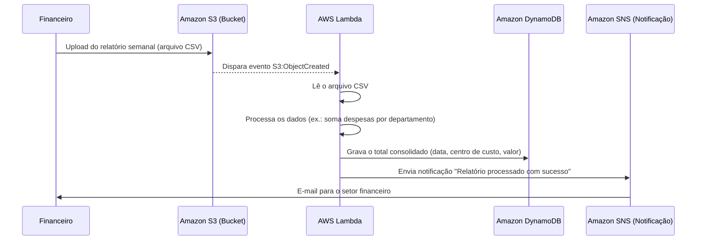

# 💼 Desafio: Automação de Relatórios Financeiros com AWS Lambda e S3

## 🧠 Descrição do Desafio

Este laboratório tem como objetivo consolidar conhecimentos em tarefas automatizadas usando AWS Lambda e Amazon S3.
O foco é desenvolver uma solução prática que demonstre como a automação pode otimizar processos administrativos e financeiros, reduzindo erros humanos e acelerando rotinas.

## ⚙️ Cenário Prático
Imagine uma empresa onde o setor financeiro precisa consolidar relatórios semanais de despesas enviados por diferentes departamentos.
Esses relatórios são planilhas .CSV armazenadas em um bucket do Amazon S3.

Atualmente, alguém precisa baixar os arquivos, abrir manualmente, somar os valores e atualizar uma planilha geral.
Com o AWS Lambda, podemos automatizar todo esse processo.

## 🔁 Fluxo Automatizado

## 🧩 Serviços AWS Utilizados
•	Amazon S3 – Armazena os relatórios financeiros em formato CSV.
•	AWS Lambda – Executa o código automaticamente a cada upload, processando e consolidando os dados.
•	Amazon DynamoDB – Registra o resultado processado (data, total, centro de custo).
•	Amazon SNS – Envia notificações automáticas para o time financeiro sobre o status do processamento.

## 💻 Exemplo Simplificado de Código Lambda (Python)
import boto3
import csv
import io

s3 = boto3.client('s3')
dynamodb = boto3.resource('dynamodb')
sns = boto3.client('sns')

TABLE_NAME = 'RelatoriosFinanceiros'
TOPIC_ARN = 'arn:aws:sns:us-east-1:123456789012:RelatorioFinanceiro'

def lambda_handler(event, context):
    bucket = event['Records'][0]['s3']['bucket']['name']
    key = event['Records'][0]['s3']['object']['key']

    response = s3.get_object(Bucket=bucket, Key=key)
    content = response['Body'].read().decode('utf-8')
    reader = csv.DictReader(io.StringIO(content))

    total_por_departamento = {}

    for row in reader:
        departamento = row['Departamento']
        valor = float(row['Valor'])
        total_por_departamento[departamento] = total_por_departamento.get(departamento, 0) + valor

    table = dynamodb.Table(TABLE_NAME)
    for departamento, total in total_por_departamento.items():
        table.put_item(Item={
            'Departamento': departamento,
            'Total': total
        })

    sns.publish(
        TopicArn=TOPIC_ARN,
        Subject='Relatório Processado com Sucesso',
        Message=f'O relatório {key} foi processado e os dados foram registrados no DynamoDB.'
    )

    return {'statusCode': 200, 'body': 'Processamento concluído com sucesso!'}

    📊 Benefícios da Solução
	•	Automação total do processo de consolidação de relatórios.
	•	Redução de erros humanos e eliminação de tarefas repetitivas.
	•	Atualização em tempo real dos dados no DynamoDB.
	•	Notificações automáticas via SNS para o time financeiro.

⸻

## 💬 Insights
•	O uso combinado de Lambda + S3 demonstra na prática o conceito de serverless e event-driven architecture (arquitetura orientada a eventos).
•	Esse tipo de automação pode ser facilmente expandido — por exemplo, para consolidar relatórios diários, gerar dashboards no QuickSight ou integrar com ERP.
•	É uma forma direta e eficiente de mostrar como a AWS pode otimizar processos financeiros e administrativos.